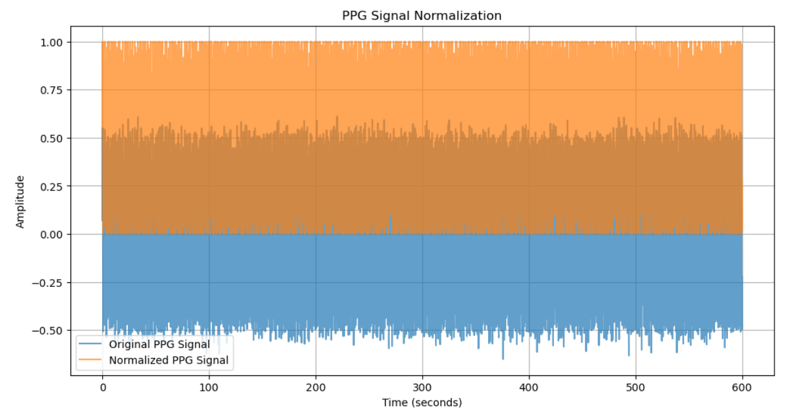

# PPG Signal Normalization Filter

This repository contains a Python script to design and apply a normalized filter to Photoplethysmogram (PPG) data sampled at 10 Hz for a duration of 10 minutes. The filter normalizes the data in segments of 2 seconds (20 samples) each, ensuring the data is consistently scaled for analysis or visualization purposes.

## Project Overview

Photoplethysmography (PPG) is a non-invasive technique to detect blood volume changes in the microvascular bed of tissue, commonly used in heart rate monitoring and pulse oximeters. This project provides a way to normalize PPG data to enhance the readability and comparability of segments.

## Features

- **PPG Signal Simulation**: Generates synthetic PPG data for demonstration purposes.
- **Normalization**: The signal is normalized every 2 seconds, rescaling each segment to the range [0, 1].
- **Visualization**: A plot is generated to compare the original and normalized signals.

## Usage

1. Clone this repository:
    ```bash
    git clone https://github.com/username/ppg-normalization-filter.git
    cd ppg-normalization-filter
    ```

2. Install the required libraries if necessary:
    ```bash
    pip install numpy matplotlib
    ```

3. Run the Python script to generate and normalize the PPG signal:
    ```bash
    python ppg_normalization.py
    ```

## Example Plot

Below is an example plot showing the original and normalized PPG signal over time.



## Code Explanation

The `normalize_ppg` function takes in the PPG signal and normalizes it in segments of 2 seconds (20 samples), by finding the minimum and maximum within each segment and scaling the data to the range [0, 1].

```python
def normalize_ppg(signal, segment_length):
    normalized_signal = np.copy(signal)
    num_segments = len(signal) // segment_length
    
    for i in range(num_segments):
        start_index = i * segment_length
        end_index = start_index + segment_length
        segment = signal[start_index:end_index]
        
        # Normalize to range [0, 1]
        min_val = np.min(segment)
        max_val = np.max(segment)
        
        if max_val - min_val != 0:  # Avoid division by zero
            normalized_signal[start_index:end_index] = (segment - min_val) / (max_val - min_val)
    
    return normalized_signal
